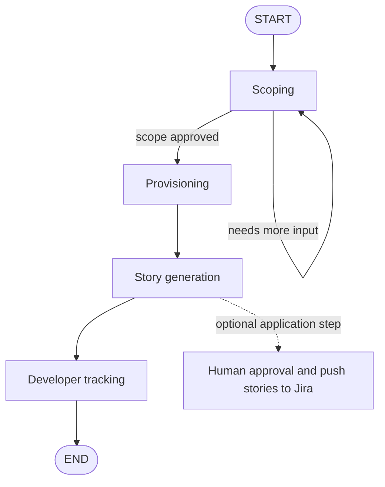

# Agentic AI Enabled Project Manager

A Python project manager agent built with LangGraph. It turns a conversational project description into an approved feature scope, provisions a GitHub repository and Jira project, generates validated user stories, and processes developer status updates.

The repository is currently a working foundation with standalone CLI runners and tests. External GitHub, Jira, and DeepSeek calls are real when the corresponding scripts are run; most unit tests mock those boundaries.

## What It Does

The agent supports four project-management phases:

1. **Scoping**: holds a conversation with a requester and looks for a structured `<feature_list>` JSON block in the model response. The block supplies proposed features and the `scope_approved` flag.
2. **Provisioning**: creates a private GitHub repository and a Jira project, then discovers the Jira project's workflow transitions and maps them to the internal statuses `backlog`, `in_progress`, `review`, and `done`.
3. **Story generation**: converts approved features into JSON stories. The output is validated in Python and the model can retry invalid output up to three times.
4. **Developer tracking**: classifies a developer message, matches it to one of that developer's open stories with local embeddings, and either transitions the Jira issue automatically or asks for confirmation.

The compiled graph in `pm_agent/graph.py` currently runs `scoping -> provisioning -> story_gen -> tracking`. The separate `push_stories_node` is implemented and tested, but is not yet connected to that compiled graph; use it from application code when Jira issue creation is intended.

## Architecture



`PMAgentState` in `pm_agent/state.py` is the shared state contract. Important fields include:

| Field | Purpose |
| --- | --- |
| `project_id` | Project name or identifier used for resource names. |
| `conversation_history` | Chat messages used by scoping and tracking. |
| `proposed_features` | Features extracted during scoping. |
| `scope_approved` | Controls whether the graph leaves scoping. |
| `github_repo_url` | URL returned by GitHub after repository creation. |
| `jira_project_key` | Key returned by Jira after project creation. |
| `status_map` | Project-specific Jira transition IDs for internal statuses. |
| `stories` | Generated stories and, after Jira creation, API-generated issue keys. |
| `story_embeddings` | Cached vectors used to match tracking messages. |
| `needs_human_review` | Indicates invalid generation output, a declined approval, or failed Jira pushes. |
| `phase` | Current phase: `scoping`, `provisioning`, `story_gen`, or `tracking`. |

## Prerequisites

- Python 3.10 or newer
- A DeepSeek API key
- A GitHub token allowed to create repositories for the authenticated user
- A Jira site URL and API token
- A Jira account with permission to create projects, issues, and transitions

## Installation

Create and activate a virtual environment from the repository root:

```powershell
python -m venv .venv
.venv\Scripts\Activate.ps1
```

On macOS or Linux, use `.venv/bin/activate` instead.

Install the dependencies:

```bash
python -m pip install -r requirements.txt
```

Create the local environment file:

```powershell
Copy-Item .env.example .env
```

Never commit `.env`; it contains credentials.

## Configuration

`pm_agent.config.load_settings()` loads `.env` automatically and fails fast if any required variable is missing.

| Variable | Required | Description |
| --- | --- | --- |
| `DEEPSEEK_API_KEY` | Yes | API key for the OpenAI-compatible DeepSeek chat API. |
| `DEEPSEEK_BASE_URL` | No | API base URL; defaults to `https://api.deepseek.com`. |
| `DEEPSEEK_MODEL` | No | Model name; defaults to `deepseek-chat`. |
| `DEEPSEEK_TEMPERATURE` | No | Model temperature; defaults to `0.2`. |
| `GITHUB_TOKEN` | Yes | Token used to create a private repository. |
| `JIRA_API_TOKEN` | Yes | Jira API token. |
| `JIRA_BASE_URL` | Yes | Jira site URL, for example `https://example.atlassian.net`. |
| `JIRA_EMAIL` | Recommended | Atlassian account email for Jira Cloud basic authentication. |
| `LANGCHAIN_TRACING_V2` | No | Set to `true` to enable LangSmith tracing. |
| `LANGCHAIN_API_KEY` | No | LangSmith API key. |
| `LANGCHAIN_PROJECT` | No | LangSmith project name; defaults to no explicit project. |

The `.env.example` file contains placeholders for all supported variables.

## Running the CLIs

Run the commands from the repository root after activating the virtual environment.

### Scoping

```bash
python scripts/run_scoping.py
```

This starts an interactive conversation. Continue describing the project and its features until the model emits an approved feature list. The script then prints the parsed feature JSON. Press `Ctrl+C` or send EOF to exit.

### Provisioning

```bash
python scripts/run_provisioning.py
```

Enter a project name or ID. The script will attempt to:

- create a private GitHub repository using a slugified project name;
- create a Jira project using a Jira-compatible key;
- inspect the Jira workflow, including a temporary probe issue when the project has no existing issues; and
- build the internal-to-Jira transition map.

This command changes real external accounts. Repository and project names must not already conflict with existing resources.

### Story generation

```bash
python scripts/run_story_gen.py
```

This runs generation against the sample features embedded in the script. A valid response must be JSON containing a `stories` list. Each story requires a non-empty internal ID, a 5-100 character title, a description, at least one acceptance criterion, and story points from `1, 2, 3, 5, 8, 13`.

The script reports the number of attempts and whether human review is required. It does not create Jira issues.

### Developer tracking

```bash
python scripts/run_tracking.py
```

This uses demo state containing two assigned stories. Enter updates such as `I started the task capture form` or `the progress dashboard is ready for review`. Tracking behavior is:

- non-status messages are logged without a Jira transition;
- messages are matched only against open stories assigned to the current developer;
- scores above `0.85` can transition automatically;
- scores above `0.60` and up to `0.85` ask for story confirmation; and
- completion updates always ask for confirmation before moving a story to `done`.

The first run may download the `sentence-transformers/all-MiniLM-L6-v2` model. The model is cached locally after download.

### Jira workflow inspection

```bash
python scripts/inspect_jira_workflow.py PROJ
```

Replace `PROJ` with a Jira project key. The command prints the transitions available to that project and is useful when diagnosing status mapping failures.

## Pushing Stories to Jira

`pm_agent.nodes.push_stories.push_stories_node` is the explicit human-approved Jira creation step. It prints the generated stories and asks:

```text
Create these stories in Jira? [y/n]:
```

Approved stories are created sequentially with the `pm-agent` label. Jira-generated issue keys are written back into each successful story. Jira rate-limit responses are retried, and failures are returned in `jira_push_failures` while successful stories remain available in state.

The LLM is never allowed to invent `jira_issue_key` values; those keys must come from Jira API responses.

## Testing

Run the complete test suite:

```bash
pytest
```

The tests cover configuration/state behavior, scoping and story generation, story validation and matching, confidence gates, GitHub tools, Jira tools, workflow/status mapping, and Jira push behavior. Tests should not require valid external credentials because integration boundaries are mocked.

For a more concise test report:

```bash
pytest -q
```

## Project Layout

```text
pm_agent/
  config.py                 Environment and runtime settings
  graph.py                  LangGraph assembly and routing
  llm.py                    DeepSeek OpenAI-compatible client factory
  state.py                  Shared PMAgentState TypedDict
  nodes/
    scoping.py              Conversational scope collection
    provisioning.py         GitHub/Jira resource provisioning
    story_gen.py             Story generation and retry loop
    push_stories.py          Human-approved Jira issue creation
    tracking.py              Developer update processing
  prompts/                  LLM system prompts
  tools/                    GitHub, Jira, approval, and status helpers
  tracking/                 Intent, matching, confidence, and event logging
  validation/               Deterministic story validation
scripts/                    Standalone CLI entry points
tests/                      Unit tests
```

## Troubleshooting

**Missing environment variables**

Run from the repository root and confirm that `.env` exists and contains non-placeholder values. The required variables are `DEEPSEEK_API_KEY`, `GITHUB_TOKEN`, `JIRA_API_TOKEN`, and `JIRA_BASE_URL`.

**Jira status mapping fails**

Jira workflows are project-specific. Run the workflow inspection command and check that transitions exist for backlog, in progress, review, and done. The mapper matches normalized transition names and destination status names against aliases; it does not assume fixed Jira transition IDs.

**GitHub repository creation fails**

Check token validity, repository-creation permissions, rate limits, and whether the generated repository name already exists. Transient network errors are retried with exponential backoff.

**Tracking asks for story selection**

This is expected when there are no assigned open stories or when the embedding similarity is at or below the confirmation threshold. The current CLI prints the available open stories for manual selection, but does not yet implement a numbered selection prompt.

**Story generation requests human review**

Inspect the model response and validation errors in tests or application logs. The node retries invalid JSON/schema output three times, then sets `needs_human_review` to `True`.

## Design Notes

- DeepSeek is accessed through `langchain-openai` because its API is OpenAI-compatible.
- Jira workflow transitions are discovered at runtime instead of hardcoding IDs, because IDs differ between projects and workflows.
- Story structure is validated with deterministic Python code after generation; an LLM response alone is not trusted as a valid contract.
- Developer-story matching uses local `sentence-transformers` embeddings. The matching model is not sent a developer message through a remote embedding API.
- The current runners are demonstrations and integration probes. A production service should add durable graph checkpoints, authentication, authorization, structured logging, and explicit handling for partial provisioning failures.
